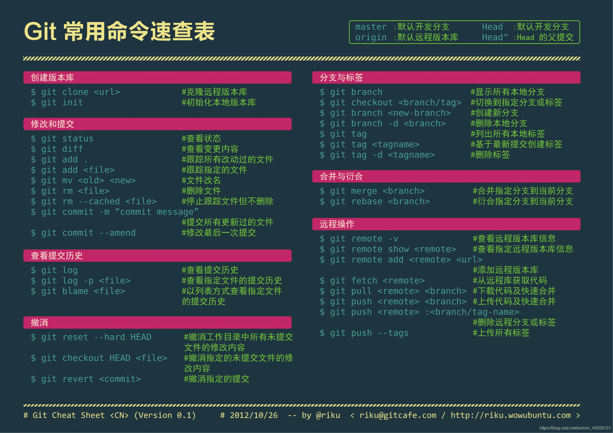
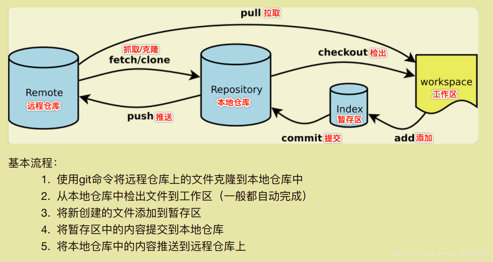

# 准备工作
## 软件安装
### Git Cli
* [Git Cli](https://git-scm.com/)
### TortoiseGit
* [TortoiseGit](https://tortoisegit.org/)

> sourceFiles文件夹中已包含上述安装文件，其他较有名的Git客户端软件还有[SourceTree](https://www.sourcetreeapp.com/)，可自行探索

## Git操作基本流程


## 创建本地仓库
### 创建本地仓库
```bash
mkdir sourceFiles
cd sourceFiles
git init
```
### 添加文件到本地仓库
```bash
git add .
```
### 提交文件到本地仓库
```bash
git commit -m "first commit"
```
### 查看仓库状态
```bash
git status
```
### 查看仓库历史记录
```bash
git log
```