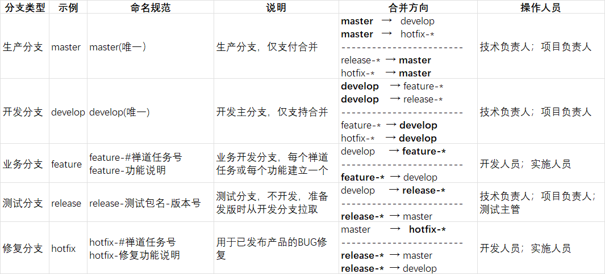
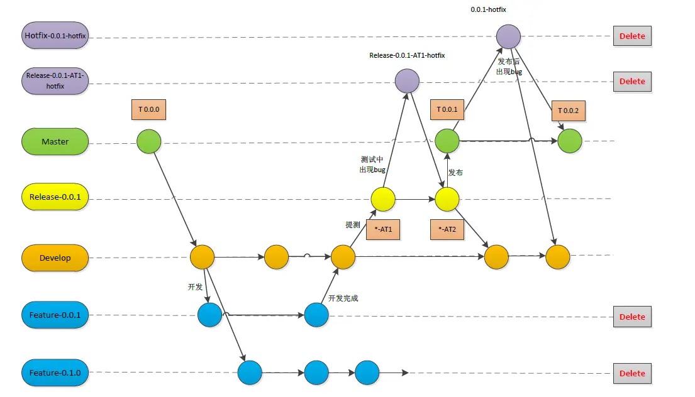

# 总则
本文件用于确认技术部门与实施部门的Gitlab分支规范。
# 说明
本文件参考了Git Flow 规范
# 分支命名规范

* 工作流使用2个分支来记录项目的历史：master，develop。
* master分支存储了正式发布的历史，而develop分支作为功能的集成分支。
* feature-*分支用于不同功能的开发，开发人员根据功能需求创建feature-*分支，开发完成后合并到develop分支。
* release-*分支用于发布前的准备，在release-*分支上合并develop分支的代码，并对版本进行测试。

## master分支：
存储了正式发布的历史。master分支上的所有提交均分配一个版本号。
## develop分支：
作为功能的集成分支，集中feature-，hotfix-相关更新。也从develop分出新的feature分支。
## feature-*分支：
每个新功能位于一个自己的分支，这样可以push到中央仓库以备份和协作。功能分支是使用develop分支作为父分支。当新功能完成时，合并回develop分支。
## release-*分支：
develop分支上有了做一次发布（或者说快到了既定的发布日）的足够功能，就从develop分支上fork一个发布分支。新建的分支用于开始发布循环，所以从这个时间点开始之后新的功能不能再加到这个分支上。这个分支只应该做Bug修复、文档生成和其它面向发布任务。
一旦对外发布的工作都完成了，发布分支合并到master分支并分配一个版本号打好Tag。另外，这些从新建发布分支以来的做的修改要合并回develop分支。
使用一个用于发布准备的专门分支，可以在完善当前的发布版本的同时，团队可以继续开发下个版本的功能。
## hotfix-*分支：
用于生成快速给产品发布版本（production releases）打补丁，这是唯一可以直接从master分支fork出来的分支。修复完成，修改应该马上合并回master分支和develop分支（当前的发布分支），master分支应该用新的版本号打好Tag。

# 执行流程

# 版本号规范
版本号分为3部分：主版本号.次版本号.修订号，版本号递增规则如下：
* 主版本号：当你做了不兼容的 API 修改，
* 次版本号：当你做了向下兼容的功能性新增，
* 修订号：当你做了向下兼容的问题修正。
* 先行版本号以 dashes 连接，从 0.1.0-alpha.1 开始，
* 正式版本没有先行版本号。
* 先行版本号可以加到正式版本的版本号后面，作为扩展。
* 参考：http://semver.org/lang/zh-CN/

