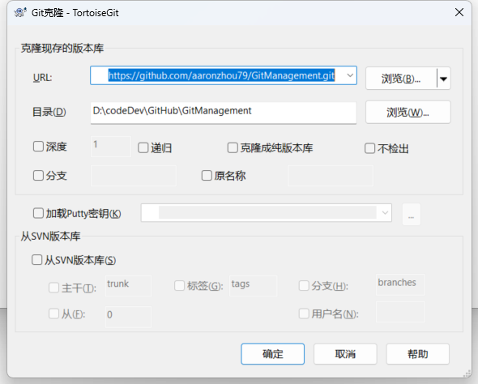
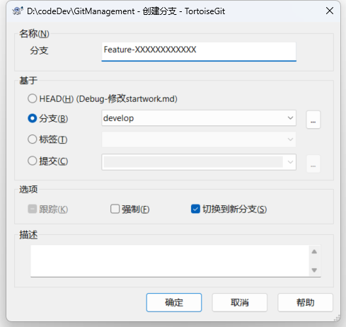
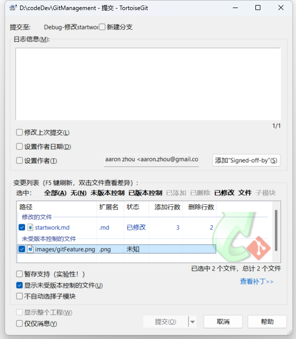
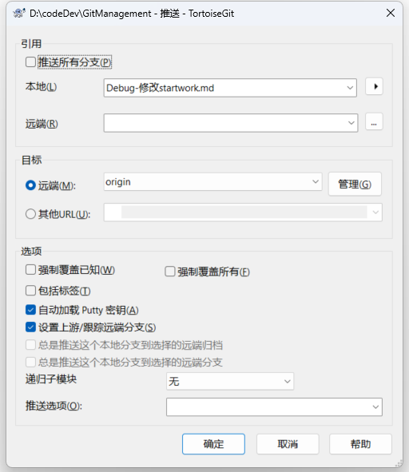

我是在远程修改的！

# 1. 从远程仓库中克隆代码到本地


# 2. 创建feature分支
```
  右键 --> TortoiseGit --> 创建分支
    名称：Feature-#禅道任务号
    分支：develop
    选项：切换到新分支
```


完成之后，会切换到feature分支，并自动更新到develop分支的最新代码。

# 3. 开发代码
```
进行正常的代码开发，完成任务后，提交代码到本地仓库。

  右键 --> Git 提交
    日志信息：输入所做的工作说明
    变更列表：选择需要提交的文件
    提交
```

该操作可以进行多次，直到真正完成【Feature-#禅道任务号】中的任务。

# 4. 推送代码到远程仓库


# 5. 合并feature到develop
    至此，所有该任务项的任务已完成，需要合并到develop分支。该事项由项目负责人或开发负责人在管理端完成！
